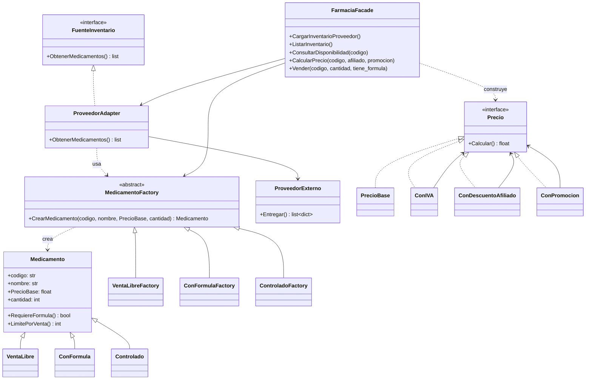

# Especificación SDD — FarmaTrack

Sistema de consola para una única farmacia en Colombia. Versión del documento: 1.0

---

## 1. Problema

**Contexto.** FarmaTrack es un programa de consola que gestiona el inventario básico de una farmacia: permite consultar medicamentos, ver disponibilidad y precio final, registrar ventas y recibir inventario desde un proveedor externo.

**Usuario.** El farmaceuta o encargado de la farmacia. No necesita conocer detalles técnicos del sistema; solo operar un menú simple.

**Interfaz.** Toda la interacción es por consola (texto): menú de opciones, mensajes y resultados impresos. No hay interfaz gráfica ni web.

**Necesidad.** La farmacia maneja distintos tipos de medicamentos (venta libre, con fórmula médica y controlados), cada uno con reglas propias: unos exigen fórmula, otros tienen límites de unidades por venta. Además:

- El proveedor entrega el inventario en un formato propio (diccionarios con claves `cod`, `nom`, `cant`, `valor`, `tipo_prod`) distinto al formato interno.
- El precio final se compone de varios ajustes combinables (IVA, descuento por afiliado/tercera edad, promoción).
- El farmaceuta no debe conocer las clases internas del sistema para trabajar.

**Por qué crear objetos directamente es un problema.** Si el código instancia los medicamentos con `new`/constructores y una cadena de `if/else` según el tipo, entonces:

- El código cliente queda acoplado a las clases concretas (`VentaLibre`, `ConFormula`, `Controlado`).
- Cada lugar del código que cree medicamentos repite los mismos `if/else` (no hay un solo punto de control).
- Agregar un nuevo tipo de medicamento obliga a modificar varios archivos existentes (se viola el principio abierto/cerrado).
- Las reglas de cada tipo quedan dispersas en lugar de encapsuladas en su propia clase.

---

## 2. Requisitos

### Funcionales

- **RF-01:** El sistema debe cargar el inventario desde el proveedor externo, adaptando su formato al formato interno de medicamentos.
- **RF-02:** El sistema debe listar el inventario mostrando código, nombre, tipo, cantidad y precio base de cada medicamento.
- **RF-03:** El sistema debe rechazar la venta de un medicamento con fórmula si el usuario indica que no tiene fórmula médica.
- **RF-04:** El sistema debe rechazar la venta si la cantidad solicitada supera el límite por venta del tipo de medicamento.
- **RF-05:** El sistema debe rechazar la venta si la cantidad solicitada supera el stock disponible.
- **RF-06:** El sistema debe calcular el precio final combinando los ajustes aplicables (IVA siempre, descuento de afiliado si aplica, promoción si aplica) de forma acumulable.
- **RF-07:** El sistema debe descontar del stock la cantidad vendida cuando la venta sea exitosa.
- **RF-08:** El sistema debe aceptar opcionalmente un código para consultar la disponibilidad y el precio de un medicamento sin venderlo.

### No funcionales

- **RNF-01:** El programa no debe cerrarse ante ninguna entrada inválida (opción de menú, código inexistente, cantidad no numérica); debe mostrar un mensaje y volver al menú.
- **RNF-02:** El código debe estar comentado en español, identificando el rol de cada clase en el patrón que implementa.
- **RNF-03:** Deben usarse exactamente 1 patrón creacional (Factory Method) y 3 patrones estructurales (Adapter, Decorator, Facade), sin patrones ni librerías adicionales.
- **RNF-04:** Deben usarse solo las librerías incluidas en el SDK de .NET (C#), sin paquetes NuGet externos.
- **RNF-05:** La interfaz de consola solo debe comunicarse con `FarmaciaFacade`; no debe instanciar factories, adapters ni decoradores directamente.
- **RNF-06:** Toda la interacción con el usuario debe ser por consola (menú de texto, entradas por teclado y salidas impresas); sin interfaz gráfica, web ni archivos de configuración obligatorios.

---

## 3. Patrones seleccionados

### 3.1 Factory Method (creacional)

- **Problema encontrado:** Crear medicamentos de distinto tipo con constructores directos y `if/else` dispersos acopla al cliente a clases concretas y dificulta agregar tipos nuevos.
- **Por qué ayuda:** Define una interfaz creadora (`MedicamentoFactory` con `CrearMedicamento(...)`) y deja que cada creadora concreta (`VentaLibreFactory`, `ConFormulaFactory`, `ControladoFactory`) decida qué producto instanciar.
- **Ventaja frente a la alternativa directa:** El cliente depende de la abstracción; las reglas de cada tipo quedan encapsuladas en su producto; agregar un tipo nuevo no obliga a modificar el código existente (abierto/cerrado).

### 3.2 Adapter (estructural)

- **Problema encontrado:** `ProveedorExterno` entrega datos con claves `cod`, `nom`, `cant`, `valor`, `tipo_prod`, incompatibles con la interfaz que espera el sistema (`FuenteInventario.ObtenerMedicamentos()`).
- **Por qué ayuda:** `ProveedorAdapter` implementa `FuenteInventario` y traduce el formato del proveedor al interno, usando las factories para crear los objetos `Medicamento`.
- **Ventaja frente a la alternativa directa:** Se integra el proveedor sin modificar su clase ni el resto del sistema; si el proveedor cambia su formato, solo cambia el adaptador.

### 3.3 Decorator (estructural)

- **Problema encontrado:** El precio final depende de ajustes combinables (IVA, descuento afiliado, promoción). Con herencia se necesitaría una subclase por cada combinación posible.
- **Por qué ayuda:** `PrecioBase` se envuelve con decoradores (`ConIVA`, `ConDescuentoAfiliado`, `ConPromocion`), cada uno implementando `Calcular()` sobre otro `Precio`.
- **Ventaja frente a la alternativa directa:** Los ajustes se combinan en cualquier orden y cantidad sin crear subclases nuevas; cada ajuste se puede agregar o quitar individualmente.

### 3.4 Facade (estructural)

- **Problema encontrado:** El farmaceuta no debería tener que conocer factories, adapters ni decoradores para operar la farmacia.
- **Por qué ayuda:** `FarmaciaFacade` ofrece métodos simples (`CargarInventarioProveedor()`, `ListarInventario()`, `ConsultarDisponibilidad(codigo)`, `CalcularPrecio(codigo, afiliado, promocion)`, `Vender(codigo, cantidad, tiene_formula)`) y coordina internamente los demás patrones.
- **Ventaja frente a la alternativa directa:** Una única interfaz simple oculta la complejidad del subsistema; el menú de consola solo depende de la facade.

---

## 4. Diseño propuesto

Lenguaje de implementación: **C# con .NET 10** (SDK instalado en la máquina).

### Clases principales y responsabilidades

| Clase | Archivo | Responsabilidad | Rol en patrón |
|---|---|---|---|
| `Medicamento` | `src/Modelos/Medicamento.cs` | Producto base: código, nombre, precio base, cantidad. Define `RequiereFormula()` y `LimitePorVenta()`. | Producto (Factory Method) |
| `VentaLibre`, `ConFormula`, `Controlado` | `src/Modelos/Medicamento.cs` | Subclases con reglas propias de fórmula y límite. | Productos concretos (Factory Method) |
| `MedicamentoFactory` | `src/Fabricas/MedicamentoFactory.cs` | Creadora abstracta con `CrearMedicamento(...)`. | Creadora (Factory Method) |
| `VentaLibreFactory`, `ConFormulaFactory`, `ControladoFactory` | `src/Fabricas/MedicamentoFactory.cs` | Creadoras concretas que instancian su producto. | Creadoras concretas (Factory Method) |
| `FuenteInventario` | `src/Adaptadores/Proveedor.cs` | Interfaz esperada por el sistema. | Target (Adapter) |
| `ProveedorExterno` | `src/Adaptadores/Proveedor.cs` | Simula al proveedor con datos fijos en formato propio; sin internet. | Adaptee (Adapter) |
| `ProveedorAdapter` | `src/Adaptadores/Proveedor.cs` | Traduce el formato del proveedor y crea medicamentos con las factories. | Adapter (Adapter) |
| `Precio` | `src/Precios/Precio.cs` | Interfaz con `Calcular()`. | Componente (Decorator) |
| `PrecioBase` | `src/Precios/Precio.cs` | Precio sin ajustes. | Componente concreto (Decorator) |
| `ConIVA`, `ConDescuentoAfiliado`, `ConPromocion` | `src/Precios/Precio.cs` | Decoradores que envuelven otro `Precio`. | Decoradores concretos (Decorator) |
| `FarmaciaFacade` | `src/Fachada/FarmaciaFacade.cs` | Coordina factories, adapter y decoradores; expone API simple. | Fachada (Facade) |

### Diagrama de clases (Mermaid)

### Participación de cada patrón

1. **Factory Method:** cuando el `ProveedorAdapter` recibe un medicamento del proveedor, selecciona la factory concreta según `tipo_prod` y delega en ella la creación del objeto. Ningún otro módulo instancia `VentaLibre`/`ConFormula`/`Controlado` directamente.
2. **Adapter:** `FarmaciaFacade.CargarInventarioProveedor()` llama a `ProveedorAdapter.ObtenerMedicamentos()`, que internamente usa `ProveedorExterno.Entregar()` (datos fijos) y traduce cada diccionario a un `Medicamento`.
3. **Decorator:** `FarmaciaFacade.CalcularPrecio(...)` construye `PrecioBase` y lo envuelve con `ConIVA` siempre, `ConDescuentoAfiliado` si el cliente es afiliado/tercera edad y `ConPromocion` si hay promoción vigente.
4. **Facade:** el menú de `main.py` solo invoca métodos de `FarmaciaFacade`; desconoce las factories, el adapter y los decoradores.

---

## 5. Criterios de aceptación

- **CA-01 (RF-01, Adapter).**
  Dado un `ProveedorExterno` con datos en formato propio,
  Cuando `ProveedorAdapter.ObtenerMedicamentos()` se ejecuta,
  Entonces devuelve una lista de objetos `Medicamento` con los mismos datos ya traducidos.

- **CA-02 (RF-01, Factory Method).**
  Dado un medicamento del proveedor con `tipo_prod = "controlado"`,
  Cuando el adaptador lo crea mediante la factory,
  Entonces el objeto resultante es una instancia de `Controlado` con `RequiereFormula() == True` y `LimitePorVenta()` igual al límite de controlados.

- **CA-03 (RF-06, Decorator).**
  Dado un precio base de $10.000 con IVA, descuento de afiliado y promoción activos,
  Cuando se calcula `ConPromocion(ConDescuentoAfiliado(ConIVA(PrecioBase(10000)))).Calcular()`,
  Entonces el resultado refleja los tres ajustes aplicados en cadena y coincide con el cálculo esperado documentado en el código.

- **CA-04 (RF-03, Factory Method + reglas de producto).**
  Dado un medicamento `ConFormula` en inventario,
  Cuando el usuario intenta venderlo indicando que no tiene fórmula médica,
  Entonces la venta se rechaza con un mensaje claro y el stock no cambia.

- **CA-05 (RF-04).**
  Dado un medicamento controlado con límite por venta de 2,
  Cuando el usuario intenta comprar 5 unidades,
  Entonces la venta se rechaza indicando el límite permitido.

- **CA-06 (RF-05).**
  Dado un medicamento con stock de 3,
  Cuando el usuario intenta vender 10,
  Entonces la venta se rechaza por stock insuficiente.

- **CA-07 (RF-07).**
  Dado un medicamento con stock de 20,
  Cuando se registra una venta exitosa de 5,
  Entonces el stock queda en 15.

- **CA-08 (RF-02, Facade).**
  Dado el inventario cargado,
  Cuando el usuario elige "Listar inventario",
  Entonces la consola muestra la lista llamando únicamente a `FarmaciaFacade.ListarInventario()`.

- **CA-09 (RNF-01).**
  Dado el menú principal,
  Cuando el usuario escribe una opción inexistente, un código inexistente o una cantidad no numérica,
  Entonces el programa muestra un mensaje de error y vuelve al menú sin terminar.

- **CA-10 (RNF-05).**
  Dado el código de `main.py`,
  Cuando se revisa su contenido,
  Entonces no contiene importaciones ni instanciaciones directas de factories concretas, adapters ni decoradores: todo pasa por `FarmaciaFacade`.

